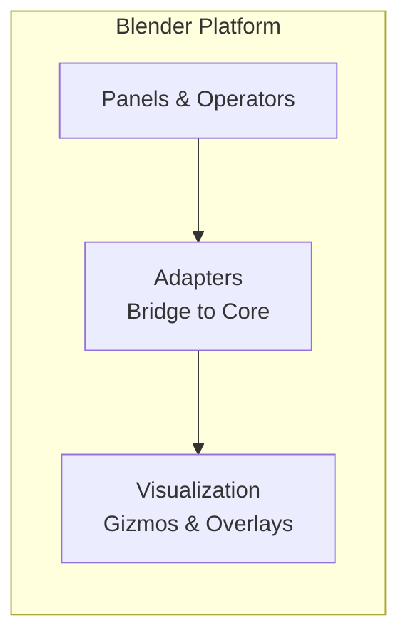
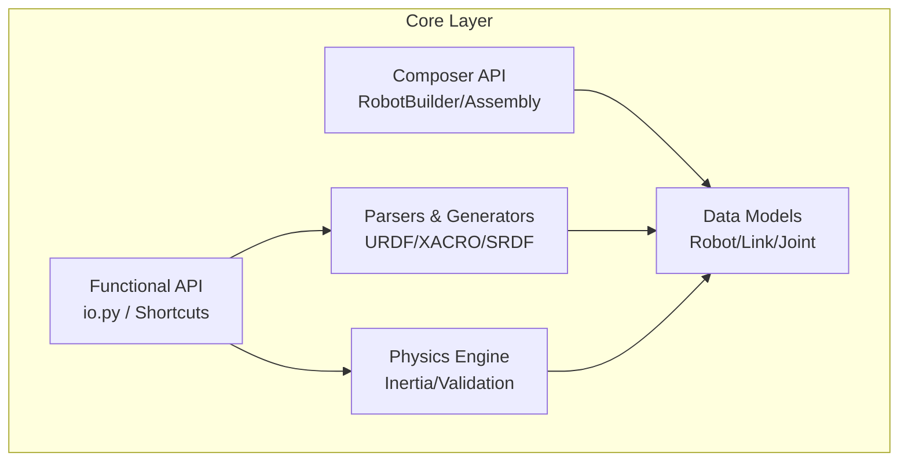
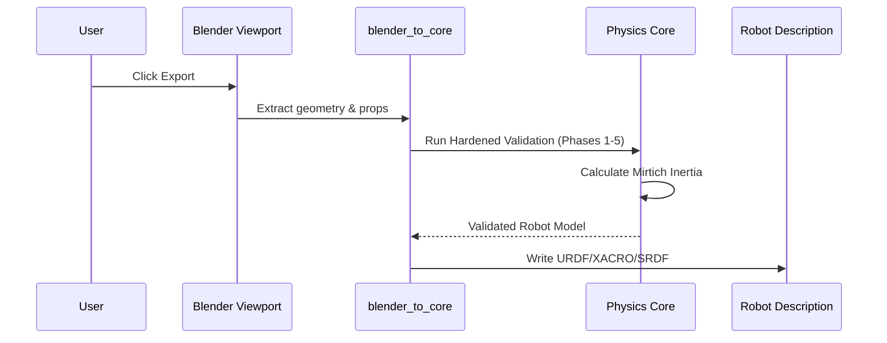

# LinkForge Architecture: The Universal Robotics Bridge

This document provides a high-level map of LinkForge's architecture. It is designed to help contributors understand the "Hexagonal" philosophy and the flow of data between Design and Robotics.

## 🔭 Architectural Philosophy: Hexagonal Core
LinkForge is built on the **Ports & Adapters (Hexagonal)** pattern. The goal is to keep the "Robotics Intelligence" (Core) completely isolated from the "Design Tool" (Blender/FreeCAD).

1.  **The Core**: Zero-dependency Python logic. Contains the "Truth" about physics (Mirtich/Sylvester), URDF structure, and robot topology.
2.  **The Platform Layer**: Adapters that translate Host data (like Blender Mesh/Objects) into Core models.

---

## 🏗️ Module Structure

### 1. Platform Layer (`platforms/blender/`)
Handles UI, Viewport visualization, and user interaction.

### 2. Core Logic Layer (`core/src/linkforge/core/`)
The platform-independent heart of the project. **Strictly Zero-Dependency.**

---

## 🌊 Data Workflows

### The "Bridge" Flow (Blender ➜ Robot Model)
This is how LinkForge converts design intent into physical parameters.

---

## 💎 Core Engineering Principles

| Principle | Description |
| :--- | :--- |
| **Physics is Truth** | We prioritize numerical accuracy. If a mesh is broken, the linter "Fails in Editor" rather than "Fails in Sim." |
| **Zero-Dependency** | The Core must remain lightweight and portable. No NumPy or C++ dependencies in the simulation logic. |
| **Bake the Transforms** | To prevent "Origin Drift" between tools, we automatically normalize and bake transforms during import/export. |
| **Resilient Parsing** | Our URDF parser is "Lossless"—it preserves unknown tags and handles malformed XML gracefully. |

---

## ⚡ Performance & Security
*   **Numerical Stability**: We use local origin-shifting (numerical conditioning) for all inertia integrals.
*   **Linear Scaling**: Inertia and Topology checks scale linearly with vertex/triangle count ($O(V+T)$).
*   **Resource Guards**: Hard limits on XML nesting (2000 levels) and file sizes (100MB) to prevent resource exhaustion attacks.

---

**Last Updated:** 2026-05-16
**Version:** 1.3.0
