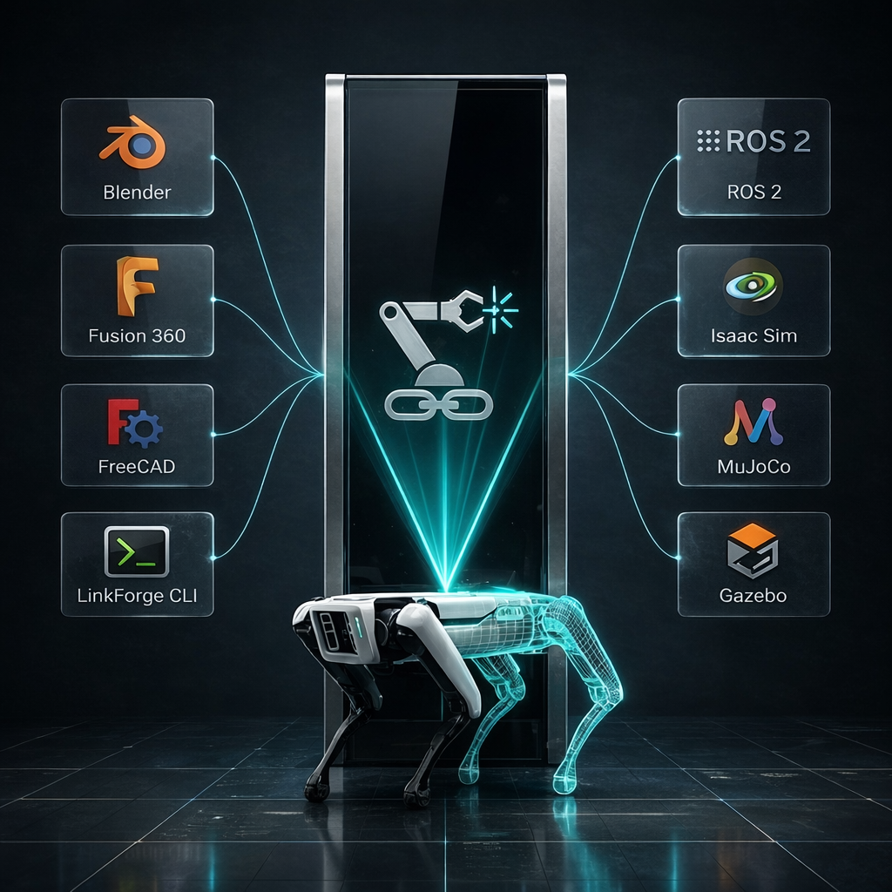

# LinkForge: The Missing Link in Robotics

## 🎯 Our Mission
To build the **LLVM for Robotics**. We are eliminating the fundamental gap between creative 3D design and high-fidelity robotics engineering by providing a unified, lossless Intermediate Representation (IR). We empower roboticists to lint, validate, and deploy their "Digital Twins" from a single source of truth: the `.lf` standard.

## 🎓 Who Uses LinkForge?

*   **Hardware Engineers & Researchers**: Designing novel robots and publishing reproducible, mathematically rigorous models.
*   **AI & RL Practitioners**: Generating thousands of varied, accurate simulation environments for training Embodied AI models.
*   **Indie Startups & Open-Source Community**: Building prototypes and sharing verifiable robot designs via the global LinkForge registry without expensive enterprise CAD licenses.

---

## 🌉 The Universal Robotics Bridge

There is a fundamental "impedance mismatch" in the modern robotics workflow. LinkForge exists to eliminate it by redefining how we treat robot descriptions.

### The Problem: "Executables" vs. "Source Code"
Currently, the robotics ecosystem treats formats like URDF, SDF, and MJCF as the source of truth. However, these are actually **"Executables"**—lossy, environment-specific snapshots compiled from opaque CAD tools.

When you export a robot to URDF, you are "compiling" it. If you manually fix a joint limit in the XML, you cannot easily "decompile" that change back into your CAD model. Your design intent is lost in a one-way, destructive pipeline.

### The Solution: The `.lf` Standard
LinkForge introduces the `.lf` file format—the **"Source Code"** for robotics.
*   **The Git for Robotics**: Just as Git tracks code changes, LinkForge tracks the physical intent of your robot.
*   **Unified Truth**: The `.lf` format acts as a high-fidelity translator ensuring your design intent is mathematically preserved across the entire development lifecycle:

**Design Systems** (Blender, FreeCAD) ➜ **LinkForge Core (`.lf`)** ➜ **Simulation & Production** (ROS 2, MuJoCo, Isaac Sim)

---

## 🔭 The "Digital Twin" North Star

We believe a simulator should never be "close enough." It should be identical. Our North Star is the perfect **Digital Twin**:
*   **True Round-Trip Engineering**: Import legacy models, validate them, edit them visually, and redeploy them anywhere without data destruction.
*   **Physics as Truth**: Every mass calculation and inertia tensor is scientifically grounded. If the physics are wrong, the Linter catches it *during* the design phase—long before it hits hardware.
*   **Numerical Integrity**: We enforce double-precision physics over approximations, ensuring that your robot behaves the same way in MuJoCo as it does in the real world.

---

## 💎 The LinkForge Competitive Edge

Why LinkForge is the infrastructure for the next generation of robotics:

| Feature | Legacy Tooling | LinkForge Platform |
| :--- | :--- | :--- |
| **Architecture** | Monolithic / Tied to one CAD tool | **Hexagonal / Multi-Host & Multi-Target** |
| **Format** | XML-based, Lossy, Fragmented | **JSON/YAML `.lf` Standard (Metadata-Rich)** |
| **Validation** | Post-Export (Fail in Sim) | **Automated Linting (Fail in Editor)** |
| **Physics** | "Close Enough" Mesh Export | **Scientific Inertia & Mass Sanity** |
| **Asset Loading** | Fragile Local File Paths | **Cloud-Native `lf://` URI Resolution** |

---

## 🏗️ Technical Strategy: The Hexagonal Core

LinkForge is the **"LLVM for Robotics."** By utilizing a **Hexagonal Architecture**, we remain framework-independent:
*   **Decoupled Intelligence**: Our "Robotics Brain" (`linkforge_core`) is isolated from specific UI hosts or simulation engines.
*   **Model Once, Deploy Anywhere**: Write your robot once in `.lf`, and swappable adapters generate the exact MJCF, URDF, or SDF needed for your specific runtime.

---

## 🚀 Future Horizons

We are building the infrastructure for the next generation of autonomy:
*   **🛡️ Kinematic Intelligence**: Built-in solvers to validate workspace reachability inside the visual editor.
*   **🧠 Intelligence-Driven Rigging**: Graph Neural Networks (GNNs) that automate joint placement based on mesh topology.
*   **📦 The LinkForge Package Manager (LPM)**: A decentralized registry for verified robot components.
*   **🌊 High-Fidelity Noise Injection**: Modeling real-world sensor imperfections directly in the IR to close the Sim-to-Real gap.

---

## 🗺️ Vision 2030: The Universal Connector

By 2030, the "monolithic robot" will be a thing of the past. We believe the robotics industry will evolve into a modular ecosystem where specialized components—legs, torsos, manipulators—just work together.

**LinkForge is the "USB Port" for this future.** By providing a universal Intermediate Representation (IR), we enable a global ecosystem where any **standard-compliant** part can be integrated into any assembly with zero friction. We are building the **foundational infrastructure** for the physical world.

---

> [!IMPORTANT]
> **LinkForge** is built for developers who know that in robotics, **Physics is Truth**. We provide the infrastructure; you build the future.
